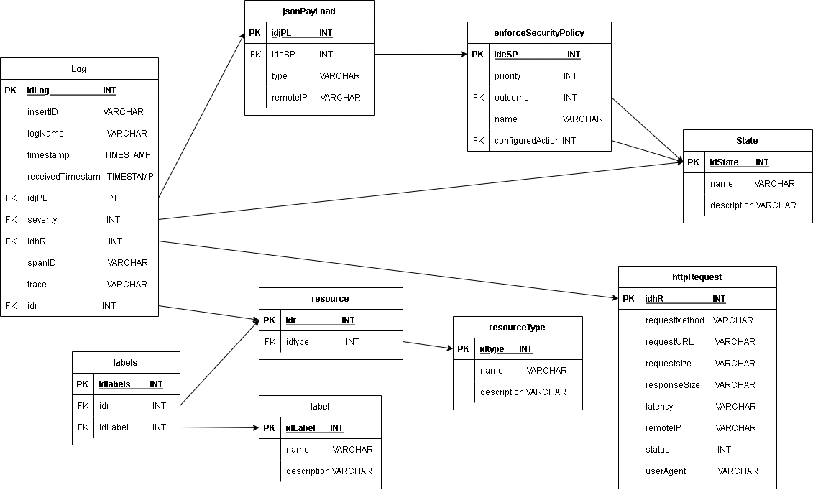

# Prueba Corta # 7 & 8

**Fecha de entrega**: *02/11/22 10:00 pm*

**Estudiante:** *David José Espinoza Soto - 2016012024*

1. Realice un modelo entidad relación normalizado hasta mínimo BCNF (Forma Normal
de Boyce-Codd) de la siguiente información de logs almacenada por un
balanceador de carga en la plataforma GCP: ...

Respuesta:

